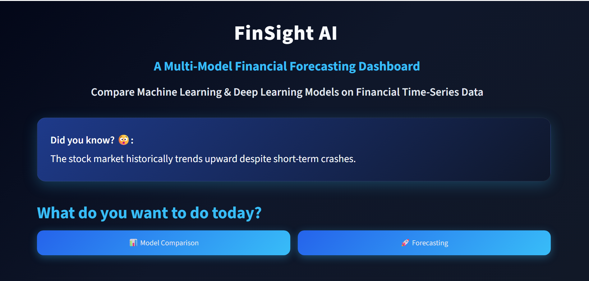
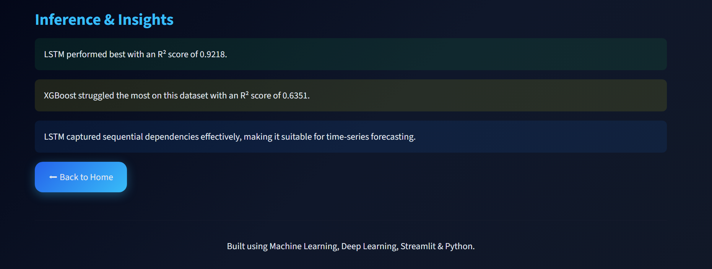

# FinSight AI

AI-Powered Financial Forecasting & Model Comparison Dashboard

FinSight AI is a machine learning and deep learning based financial forecasting dashboard that compares multiple predictive models on different financial assets such as Tesla, Apple, Gold, Oil, and Samsung.

The project includes:

* Exploratory Data Analysis (EDA)
* Feature Engineering
* Machine Learning Models
* Deep Learning (LSTM)
* Interactive Streamlit Dashboard
* Model Comparison & Visualization

Built using Python, Scikit-learn, TensorFlow, XGBoost, and Streamlit.

## Features

### Financial Asset Analysis

* Tesla
* Apple
* Gold
* Oil
* Samsung

### Machine Learning Models

* Linear Regression
* Random Forest Regressor
* XGBoost Regressor

### Deep Learning

* LSTM (Long Short-Term Memory)

### Dashboard Features

* Interactive Streamlit Dashboard
* Model Comparison
* Actual vs Predicted Visualization
* Animated Interactive Charts
* Random Finance Facts
* Best/Worst Model Detection
* AI-style Insights & Inference

### Evaluation Metrics

* MAE (Mean Absolute Error)
* RMSE (Root Mean Squared Error)
* R² Score

## Tech Stack

### Programming Language

* Python

### Data Analysis & Visualization

* Pandas
* NumPy
* Matplotlib
* Plotly

### Machine Learning

* Scikit-learn
* XGBoost

### Deep Learning

* TensorFlow
* Keras

### Dashboard & Deployment

* Streamlit

### Model Persistence

* Joblib

## Project Workflow

1. Data Collection
2. Exploratory Data Analysis (EDA)
3. Feature Engineering
4. Model Training
5. Model Evaluation
6. Model Comparison
7. Dashboard Visualization
8. Deployment

---

## Project Structure

FinSight-AI/
│
├── app.py
├── README.md
│__ requirements.txt
|__ docs
|__ screenshots/
|
├── data/
│   |__ after_EDA
|   |__ after_F_Eng
|   |__ raw
|
├── models/
│   ├── apple/
│   ├── tesla/
│   ├── gold/
│   ├── oil/
│   └── samsung/
│
├── results/
│   ├── apple/
│   ├── tesla/
│   ├── gold/
│   ├── oil/
│   └── samsung/
│
├── notebooks/
│   ├── 01_eda.ipynb
│   ├── 02_feature_engineering.ipynb
│   └── 03_models.ipynb

## Installation & Setup

### 1. Clone the Repository

git clone https://github.com/your-username/FinSight-AI.git

---

### 2. Move into Project Folder
cd FinSight-AI

---

### 3. Create Virtual Environment
python -m venv venv

---

### 4. Activate Virtual Environment

#### Windows
venv\\Scripts\\activate

#### Mac/Linux
source venv/bin/activate

---

### 5. Install Required Libraries
pip install -r requirements.txt

---

### 6. Run Streamlit Dashboard
streamlit run app.py

## Dashboard Screenshots

### Home Page

---
### Model Selection

### Model Comparison

---

### Interactive Forecast Chart

### Inferences

## Results

* Linear Regression performed best on several datasets due to strong trend continuity.
* LSTM successfully captured sequential patterns in time-series financial data.
* Random Forest and XGBoost showed varying performance depending on asset volatility.
* Interactive visualization helped compare actual vs predicted prices effectively.

### Evaluation Metrics Used

* MAE (Mean Absolute Error)
* RMSE (Root Mean Squared Error)
* R² Score

## Future Improvements

* Future price forecasting
* Live financial data integration
* Candlestick chart visualization
* User authentication system
* Cloud deployment improvements
* Advanced deep learning architectures
* Real-time prediction updates
* Portfolio analysis features

## Live Demo
    https://finsight-ai-mdywdwnssfq9us7hkfzbz3.streamlit.app/
    
## Author

Maria Khan

B.Tech CSE Student | Machine Learning & AI Enthusiast
